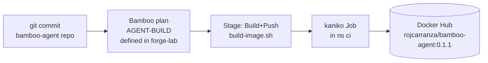
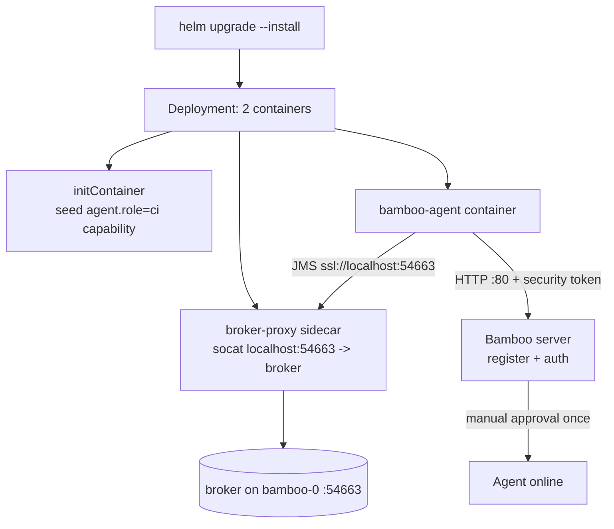

# bamboo-agent — Learning Guide

A study companion for this project. It explains **what** was built, **why** each
piece exists, **how** it works with forge-lab, and **how to run and review** it.
Read it next to the code and the git history — every design decision here maps to
a real commit you can inspect.

---

## 1. The one-paragraph summary

forge-lab runs a Bamboo CI server inside a local Kubernetes cluster (Rancher
Desktop). Bamboo runs builds on **remote agents**. forge-lab already has a
*host-local* agent (a JVM process on your Mac) that provisions Multipass VMs.
This project, `bamboo-agent`, adds a **second, containerized agent** that runs
**inside** the cluster and specializes in CI / image-build work. It ships as a
Docker image, is built by a Bamboo pipeline (using kaniko), and is deployed with
Helm. The two agents **coexist**: the host agent keeps the Multipass jobs, the
k8s agent takes the container/image jobs.

---

## 2. Why two repositories?

| Repo | Responsibility |
|------|----------------|
| **forge-lab** | The CI *platform*: Bamboo server, Postgres, secrets, the host agent, provisioning pipelines. |
| **bamboo-agent** (this repo) | One *worker*: a containerized CI agent — its image, build pipeline, and deployment. |

Separating them mirrors real infrastructure: the platform team owns the server;
an agent is a self-contained artifact with its own lifecycle, versioning, and
git history. forge-lab only needs to know the agent's published image tag.

---

## 3. The two modules

```
bamboo-agent/
├── bamboo-agent-deployment/   # "How is the agent image built?"
│   ├── Dockerfile             # the agent image (FROM atlassian/bamboo-agent-base:12.1.8)
│   ├── VERSION                # semver source of truth for the image tag
│   ├── kaniko/                # kaniko Job template
│   └── scripts/build-image.sh # renders + runs the kaniko Job, waits, tails logs
└── bamboo-agent-helm/         # "How is the agent deployed + registered?"
    ├── Chart.yaml, values.yaml
    └── templates/             # Deployment, RBAC, ServiceAccount, broker sidecar
```

- **`bamboo-agent-deployment`** answers *build*. It has no idea about Kubernetes
  deployment — it just produces `docker.io/rojcarranza/bamboo-agent:<semver>`.
- **`bamboo-agent-helm`** answers *deploy*. It consumes a published image tag and
  installs it as a live remote agent.

They meet at exactly one contract: **the image tag** (`VERSION` ↔
`values.yaml image.tag`).

---

## 4. How a build works (data flow)



Key idea: **the agent does not build the image itself.** kaniko must run in a
throwaway container (it unpacks the base image over the container root
filesystem). So `build-image.sh` *templates a Kubernetes Job* that runs kaniko,
then waits and tails its logs. The agent only needs `kubectl`. This is why the
**host agent could bootstrap the very first build** — it already has `kubectl`,
so there was no chicken-and-egg problem.

Files to read: `bamboo-agent-deployment/scripts/build-image.sh`,
`bamboo-agent-deployment/kaniko/kaniko-job.yaml.tmpl`.

---

## 5. How deployment + registration works



Steps in order:
1. **initContainer** runs the image's own `/bamboo-update-capability.sh` to write
   `agent.role=ci` into the agent home (a shared `emptyDir`).
2. The **agent container** starts as root; the base entrypoint chowns the home to
   the `bamboo` user and drops privileges, then launches the agent.
3. The agent authenticates to the server over HTTP using the shared **security
   token** (from the existing `bamboo-agent-token` secret), then waits for
   **manual approval** (a one-time click, same as any Bamboo remote agent).
4. After approval it connects to the **JMS broker** to receive builds.

Files to read: `bamboo-agent-helm/templates/deployment.yaml`, `values.yaml`.

---

## 6. Bamboo concepts you are learning here

| Concept | What it means | Where it shows up |
|---------|---------------|-------------------|
| **Remote agent** | A build worker separate from the server; connects back over HTTP + JMS. | the whole project |
| **Security token** | Shared secret the agent presents so the server trusts it. | `bamboo-agent-token` secret, `SECURITY_TOKEN` env |
| **Agent approval** | An admin one-time confirmation before an agent runs builds. | the manual step |
| **Capability** | A fact the agent advertises (e.g. `agent.role=ci`). | initContainer, `bamboo-capabilities.properties` |
| **Requirement** | A plan's demand that only agents with a matching capability run it. | `Requirement("agent.role")` in the spec |
| **JMS broker** | ActiveMQ channel the server uses to dispatch builds to agents. | port 54663, the socat sidecar |
| **Bamboo Specs** | Plans defined as Java code, unit-testable offline, published to the server. | forge-lab `bamboo-specs/` (`lab.agent.BuildAgentImageSpec`) |
| **RSS / publish** | Pushing a Specs-defined plan to the live server. | forge-lab `make specs-publish`, `bamboo-specs/.credentials` |

**Capability ↔ requirement** is the mechanism that keeps jobs on the right
agent: the k8s agent advertises `agent.role=ci`; the `AGENT-BUILD` plan *requires*
`agent.role=ci`; the Multipass provisioning plans do not — so they never land on
the container that has no Multipass.

---

## 7. The hard parts (this is where the real learning is)

Every item below was a real failure hit during live bring-up, diagnosed, and
fixed. Each has a commit. Studying these teaches more than the happy path.

### 7.1 CPU architecture mismatch
The first image hardcoded `linux/amd64` kubectl, but Rancher Desktop on Apple
Silicon is **arm64**. kubectl crashed with a Go runtime panic. **Fix:** derive
the arch from the rootfs with `dpkg --print-architecture` — works under both
`docker buildx` and the in-cluster kaniko build.
*Lesson:* container images are per-architecture; never assume amd64.

### 7.2 `USER bamboo` broke privilege-drop
Ending the Dockerfile with `USER bamboo` made the container start as `bamboo`, so
the base entrypoint's root phase (which chowns the agent home) was skipped, and
the agent couldn't write `bin/wrapper`. **Fix:** keep `USER root`; the entrypoint
itself drops to `bamboo` after fixing permissions.
*Lesson:* read the base image's entrypoint contract before overriding `USER`.

### 7.3 Wrong server port
The agent tried `bamboo.ci.svc.cluster.local:8085` and got *connection refused*.
The Kubernetes **Service** exposes port **80** (→ pod 8085). **Fix:** use the
Service port, not the container port.
*Lesson:* Service port ≠ container port. Check `kubectl get svc`.

### 7.4 The broker + the socat sidecar (the subtle one)
forge-lab configures the Bamboo server to **advertise the broker as
`ssl://localhost:54663`** — correct for the *host* agent, which reaches it via a
`kubectl port-forward`. But an in-cluster pod's `localhost` is itself, so the
in-cluster agent could not connect.

Rather than change forge-lab (which would break the host agent), the fix is a
**socat sidecar** in the agent pod that listens on `localhost:54663` and forwards
to the real broker on `bamboo-0`. Because pod containers share a network
namespace, the agent's `localhost:54663` hits the sidecar. socat is a **raw TCP
passthrough**, so the agent's TLS session still terminates at the real broker —
`verifyHostName=false` (already in the advertised URL) covers the hostname
mismatch.
*Lesson:* when a shared server advertises an address that only suits one client,
adapt on the client side instead of changing the shared component. Sidecars are a
clean way to reshape networking for one pod.

### 7.5 Least-privilege RBAC
The agent creates kaniko Jobs, so its ServiceAccount needs Job permissions. The
first Role forgot that `build-image.sh` also *reads* the `dockerhub-push` secret
as a preflight — so the build failed with a misleading "secret missing". **Fix:**
grant `get` on **just that one secret** (`resourceNames: [dockerhub-push]`). Note
the kaniko pod *mounting* the secret needs no agent permission — the kubelet does
that.
*Lesson:* RBAC is deny-by-default; trace every API call your code makes. Scope
permissions to named resources.

### 7.6 Single-node scheduling
A rolling update tried to run two agent pods plus Bamboo on one node → *Insufficient
cpu*. **Fix:** `strategy: Recreate` (replace before create) and a smaller CPU
request.
*Lesson:* on constrained nodes, rolling updates need surge headroom; `Recreate`
trades availability for fit.

---

## 8. How to run it (from scratch)

Prerequisites: forge-lab's Bamboo running (`make bootstrap` in forge-lab), and
`make ui` port-forwarding 8085/54663.

```bash
# 0. one-time: Docker Hub push secret (your PAT; never committed)
kubectl -n ci create secret docker-registry dockerhub-push \
  --docker-server=https://index.docker.io/v1/ \
  --docker-username=rojcarranza --docker-password=<DOCKERHUB_PAT>

# 1. build + push the agent image (runs a kaniko Job in-cluster)
bamboo-agent-deployment/scripts/build-image.sh          # prints IMAGE_TAG=<semver>

# 2. deploy the agent (image.tag defaults to values.yaml, kept in sync with VERSION)
helm upgrade --install bamboo-agent ./bamboo-agent-helm -n ci

# 3. approve the agent once
#    http://localhost:8085 -> Administration > Agents > Agent authentication > Approve

# 4. publish the build pipeline into Bamboo — from the forge-lab repo
#    (needs forge-lab bamboo-specs/.credentials: token=<PAT>)
cd ../forge-lab && make specs-publish                   # publishes AGENT-BUILD + the FORGE plans

# 5. run the pipeline (or click Run in the UI). It builds the agent's own image.
```

Useful checks:
```bash
kubectl -n ci get pods -l app.kubernetes.io/name=bamboo-agent
kubectl -n ci logs deploy/bamboo-agent -c bamboo-agent | grep "ready to receive builds"
kubectl -n ci logs deploy/bamboo-agent -c broker-proxy      # the socat sidecar
```

To cut a new version: bump `bamboo-agent-deployment/VERSION` **and**
`bamboo-agent-helm/values.yaml` `image.tag` together, commit, rebuild, redeploy.

---

## 9. How to study the code (suggested reading order)

1. **`README.md`** — the map.
2. **`docs/LEARNING-GUIDE.md`** — this file.
3. **The design + plan** (in forge-lab):
   - `docs/superpowers/specs/2026-07-25-bamboo-agent-image-pipeline-design.md`
   - `docs/superpowers/plans/2026-07-25-bamboo-agent-image-pipeline.md`
   The plan is task-by-task with the exact reasoning — read it like a narrated
   build log.
4. **`bamboo-agent-deployment/Dockerfile`** — small; note the comments explaining
   `USER root` and the arch derivation (sections 7.1, 7.2).
5. **`bamboo-agent-deployment/scripts/build-image.sh`** — the kaniko orchestration.
6. **forge-lab `bamboo-specs/src/main/java/lab/agent/BuildAgentImageSpec.java`**
   — plan-as-code: stage, capability requirement, plan-local repo, `main()`
   publish. It lives in forge-lab because all lab pipelines do; this repo holds
   only what the plan checks out and runs.
7. **`bamboo-agent-helm/templates/deployment.yaml`** — initContainer, sidecar,
   token env, agent container. The comments explain each choice.
8. **`bamboo-agent-helm/templates/rbac.yaml`** — least-privilege in practice.

### Read the git history as a learning path
The commit history is deliberately small and message-driven. `git log --oneline`
reads as a story: scaffold → image → build script → specs → helm → and then the
`fix:` commits (7.1–7.6) each capture one real problem. Use:
```bash
git log --oneline
git show <hash>            # see exactly what a fix changed and why (commit body)
```

---

## 10. Exercises to deepen understanding

1. **Break 7.3 on purpose:** set `bamboo.server` back to `:8085`, redeploy, read
   the "connection refused", then fix it. Confirms you understand Service ports.
2. **Watch the capability guard:** remove the `Requirement("agent.role")` from the
   spec, republish, and see the plan become eligible for the host agent too.
3. **Trace the sidecar:** `kubectl exec` into the agent container and
   `cat < /dev/null > /dev/tcp/127.0.0.1/54663` — prove the port is open only
   because socat is forwarding. Kill the sidecar and watch the agent lose the
   broker.
4. **Tighten RBAC:** try removing the secret rule and re-running a build; read the
   failure; restore it. Reinforces deny-by-default.
5. **Cut a release:** bump `VERSION` to `0.2.0`, sync `values.yaml`, rebuild,
   redeploy, and confirm the pod pulls `:0.2.0`.

---

## 11. Glossary

- **kaniko** — builds container images from a Dockerfile without a Docker daemon,
  inside a Kubernetes pod. Pushes directly to a registry.
- **sidecar** — a helper container in the same pod as the main app, sharing its
  network and volumes.
- **Bamboo Specs** — Atlassian's plans-as-code: Java that compiles to a plan and
  is unit-testable offline (`EntityPropertiesBuilders.build(plan)`).
- **RSS (Repository Stored Specs)** — Bamboo publishing plans from code.
- **emptyDir** — an ephemeral pod-scoped volume; here it holds the agent home,
  shared between the initContainer and the agent container.
- **security token** — the 40-hex shared secret proving an agent is authorized.
- **timebomb license** — forge-lab's 24h Bamboo license fetched at runtime; not
  part of this repo but relevant to why the server is up.

---

*If a file, flag, or command in this guide ever disagrees with the code, trust
the code and the commit that changed it — then update this guide.*
